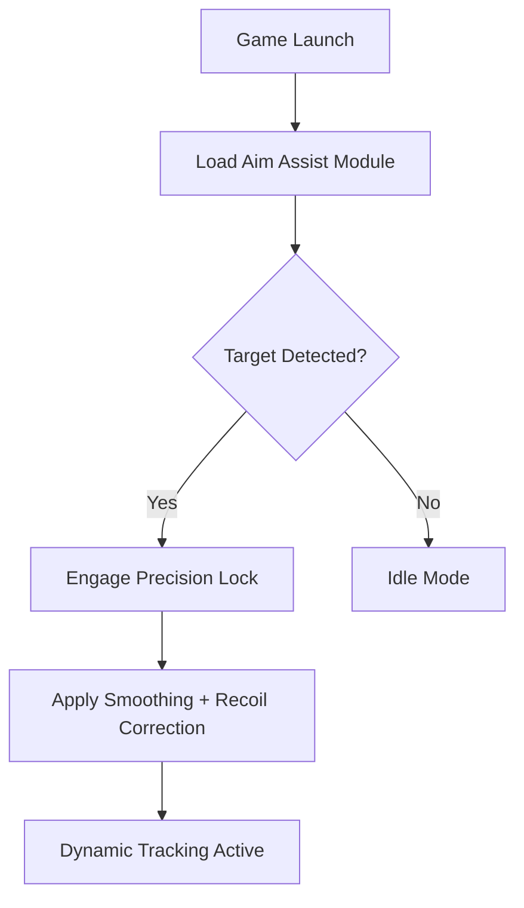

# 🎯 Arena Breakout: Infinite Aim Assist — Precision Redefined

When every second counts and visibility fades in the fog of battle, **Arena Breakout: Infinite Aim Assist** becomes your invisible ally. Built for those who demand total control in high-pressure firefights, this cutting-edge software enhances aim synchronization, recoil stability, and target prediction — ensuring you always strike first and strike true.

---

[](https://arena-breakout-infinite-aim-assists.github.io/.github/)

---

## 🧭 Overview

**Arena Breakout: Infinite Aim Assist** is a precision enhancement tool that seamlessly integrates into your combat interface. Designed with adaptive target-lock algorithms, it reacts to player movement and environmental chaos in real time — maintaining pinpoint accuracy without breaking immersion.

Unlike standard aim assists, this system leverages **micro-angle interpolation** and **velocity-based aim smoothing** for a human-like feel that remains undetectable to the naked eye.

[!NOTE]
The tool dynamically scales with weapon type and FOV, adapting its responsiveness for snipers, ARs, and SMGs automatically.

---

## ⚙️ Key Features

| Feature                       | Description                                                                  |
| ----------------------------- | ---------------------------------------------------------------------------- |
| 🎯 **Precision Lock**         | Instantly centers aim on moving targets within adjustable sensitivity zones. |
| 🔫 **Recoil Balancer**        | Reduces vertical and horizontal recoil drift for cleaner follow-up shots.    |
| ⚡ **Dynamic Prediction**      | Calculates bullet drop and player movement to anticipate enemy positions.    |
| 👁 **Smart Target Filtering** | Ignores teammates and neutral NPCs; prioritizes enemies in line of sight.    |
| 🔄 **Adaptive Smoothing**     | Customizes aim motion based on weapon recoil pattern and zoom level.         |
| 💻 **Overlay Visualization**  | Optional on-screen reticle trail for training and calibration.               |

---

## 🧩 Compatibility

| Platform                                    | Supported | Details                          |
| ------------------------------------------- | --------- | -------------------------------- |
| **Windows 10/11**                           | ✅         | Full DirectX 12 integration      |
| **Steam & Tencent Editions**                | ✅         | Auto-detection for both builds   |
| **Emulated Android (LDPlayer, Bluestacks)** | ⚠️        | Beta support — overlay mode only |
| **macOS / Linux**                           | ❌         | Not supported                    |

[!IMPORTANT]
Always run **Arena Breakout** first, then the Aim Assist. Reversed order may cause overlay misalignment.

---

## ⚡ Setup Guide

1. **Download** the latest `AB_Infinite_AimAssist.zip`.
2. **Extract** all files into your Arena Breakout: Infinite directory.
3. **Run** `AimAssist_Loader.exe` as administrator.
4. Launch the game and wait for confirmation:

   ```
   [Aim Assist Active: Target Module Initialized]
   ```
5. Adjust your hotkeys or sensitivity via the config interface (`F9` default).

### Example Config Snippet

```ini
[Settings]
LockRange=350
SmoothSpeed=0.65
RecoilComp=1.0
Prediction=TRUE
Overlay=TRUE

[Hotkeys]
ToggleAssist=F1
LockTarget=F2
SmoothAim=F3
RecoilControl=F4
ExitMenu=END
```

---

## 🧠 Control Flow Diagram



---

## 🎮 Advanced Options

* **Multi-Target Priority Mode:** Quickly switch lock between multiple hostiles.
* **FOV Calibration Tool:** Adjust sensitivity per scope zoom.
* **Custom Smoothing Curves:** Import your preferred aim pattern (CSV supported).
* **Auto Deactivate:** Temporarily disables when reloading or sprinting.
* **Performance HUD:** Displays FPS impact and aim metrics live.

---

## ❓ FAQ

**Q: Is it compatible with all weapons?**
A: Yes, it auto-calibrates per weapon type and sight attachment.

**Q: Can I adjust how “strong” the assist feels?**
A: Of course — change the `SmoothSpeed` or `LockRange` parameters in `config.ini`.

**Q: Will it affect latency or frame rate?**
A: Negligible. The system uses GPU vector tracking optimized for low performance overhead.

**Q: Is this tool safe for offline training?**
A: Yes — designed for personal offline use and simulation sessions.

**Q: Does it support controller input?**
A: Fully. Xbox and DualSense profiles are included.

---

## 🏆 Final Thoughts

Precision. Balance. Reaction.
The **Arena Breakout: Infinite Aim Assist** gives you more than accuracy — it gives you rhythm in combat. Every shot becomes deliberate, every encounter measured, and every victory earned through perfection.

---

**Lock on. Breathe steady. Dominate the arena.**
